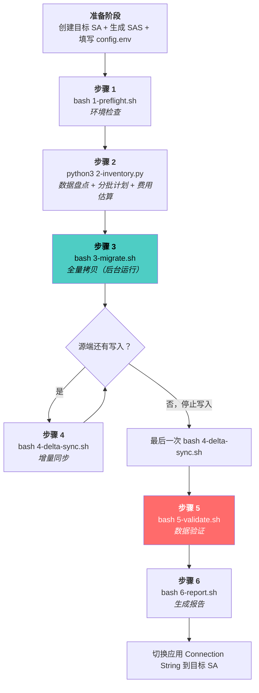

---
tags:
  - AzureStorage
  - Migration
  - AzCopy
  - Toolkit
  - SOP
  - Mooncake
category: Azure Storage / Migration Toolkit
area: Cross-Region Migration — User Guide
related:
  - "[[Storage 跨区域迁移工具包 — 设计文档]]"
  - "[[Azure Storage 跨区域迁移 — 方案选型与总览]]"
  - "[[跨区域迁移 Blob Storage — 完整操作指南]]"
  - "[[跨区域迁移 Azure Files — 完整操作指南]]"
parent: "[[Storage 跨区域迁移工具包 — AzCopy Migration Toolkit]]"
created: 2026-03-09
---

# Storage 跨区域迁移工具包 — 使用指南

> [!abstract] 读者
> 本文面向**工具包使用者**（CSS 工程师和客户），描述迁移目的、操作步骤、日志查看和常见问题处理。设计原理请参考 [[Storage 跨区域迁移工具包 — 设计文档]]。

---

## 一、工具包解决什么问题

### 1.1 背景

Azure China CE1（华东）/ CN1（华北）数据中心将于 **2026-07-01 关闭**。客户需将 Blob Storage 和 Azure Files 数据迁移到 CN3（华北三）。

### 1.2 方案概述

本工具包基于 **AzCopy S2S（Server-to-Server）** 实现跨区域数据迁移：
- 数据在 Azure 存储服务器之间直传，**不经过 VM 带宽**
- 支持 Blob Storage 和 Azure Files（SMB）
- 支持源端业务不停的**三阶段迁移**：全量拷贝 → 增量追平 → 最终切换
- 自动分批、并发调度、SSH 断连不影响

### 1.3 支持的场景

| 场景 | 支持 |
|------|:---:|
| Blob Storage 跨区域迁移（CE1/CN1 → CN3） | 是 |
| Azure Files (SMB) 跨区域迁移 | 是 |
| 单容器 / 整个 Storage Account 迁移 | 是 |
| 源端持续写入（业务不停） | 是 |
| 大文件数场景（千万级） | 是 |

> [!warning] 不支持的场景
> - **Table Storage** — 需要 ADF 或自定义代码，参见 [[跨区域迁移 Table Storage — ADF 与替代方案]]
> - **Queue Storage** — 需要自定义代码，参见 [[跨区域迁移 Queue Storage — 自定义代码方案]]


---

## 二、迁移流程总览



---

## 三、前置准备

### 3.1 创建目标端 Storage Account

在 CN3 区域创建与源端**同类型**的 Storage Account：
- 相同的 Account Kind（StorageV2）
- 相同的 Replication（LRS/GRS）
- 相同的 Access Tier（Hot/Cool）

> [!tip] 不需要提前创建容器
> `3-migrate.sh` 会自动在目标端创建容器。

### 3.2 生成 SAS Token

从 Azure Portal → Storage Account → Security + networking → Shared access signature 生成：

| | 权限 | Resource Types | Services |
|---|---|---|---|
| **源端 SAS** | `rl`（Read + List） | `sco` | `b`（Blob）或 `f`（Files） |
| **目标端 SAS** | `rwdlac`（Read + Write + Delete + List + Add + Create） | `sco` | `b` 或 `f` |

**有效期**：建议覆盖整个迁移周期，至少 30 天。

也可以用 CLI 生成：

```bash
# 源端 SAS（Blob）
az storage account generate-sas \
  --account-name <源端SA名称> \
  --permissions rl \
  --resource-types sco \
  --services b \
  --expiry $(date -u -d "+30 days" '+%Y-%m-%dT%H:%MZ') \
  --output tsv

# 目标端 SAS（Blob）
az storage account generate-sas \
  --account-name <目标SA名称> \
  --permissions rwdlac \
  --resource-types sco \
  --services b \
  --expiry $(date -u -d "+30 days" '+%Y-%m-%dT%H:%MZ') \
  --output tsv
```

> [!warning] Resource Types 必须为 `sco`（三个都选）
> | 字母 | 级别 | 哪个步骤需要 |
> |:---:|------|------------|
> | `s` | Service | `2-inventory.py` 列出容器 |
> | `c` | Container | `3-migrate.sh` 创建容器、枚举文件 |
> | `o` | Object | `3-migrate.sh` 拷贝文件 |
>
> 缺少任何一项会导致 `AuthorizationResourceTypeMismatch` 错误。

### 3.3 准备 VM

在**源端 Region** 创建 Linux VM（推荐 Ubuntu 20.04+）：
- 大小：Standard_D4s_v3 或以上
- 用途：运行脚本发出枚举请求（数据本身不经过 VM）

> [!tip] 为什么 VM 在源端？
> 虽然 S2S 数据不经过 VM，但文件枚举请求从 VM 发出。VM 在源端 Region 时枚举延迟更低。

### 3.4 上传工具包并配置

```bash
# 1. 上传 migration-toolkit/ 到 VM
scp -r migration-toolkit/ user@vm-ip:/home/user/

# 2. 编辑配置
cd migration-toolkit
vi config.env
```

`config.env` 关键配置项：

| 配置项                  | 说明                         | 示例                 |
| -------------------- | -------------------------- | ------------------ |
| `SRC_ACCOUNT`        | 源端 SA 名称                   | `srcblob2026`      |
| `DST_ACCOUNT`        | 目标端 SA 名称                  | `dstblob2026cn3`   |
| `STORAGE_TYPE`       | `blob` 或 `files`           | `blob`             |
| `CONTAINER_NAME`     | 留空 = 迁移全部容器；填写 = 只迁移指定容器   | `mydata` 或留空       |
| `SRC_SAS`            | 源端 SAS Token（不含前导 `?`）     | `se=2026-06-30...` |
| `DST_SAS`            | 目标端 SAS Token              | `se=2026-06-30...` |
| `MAX_PARALLEL_JOBS`  | 同时运行的 azcopy 作业数（建议 1-5）   | `3`                |
| `AZCOPY_CONCURRENCY` | 单个 azcopy 内部并发数（建议 64-256） | `128`              |
| `MAX_GB_PER_BATCH`   | 单 batch 最大数据量（GB），超限则按目录拆分 | `10000`（=10TB）     |
| `DELTA_SYNC_RATIO`   | 每次增量同步预估数据变化比例，用于费用估算 | `0.01`（=1%）        |

---

## 四、分步操作

### 步骤 1：环境检查

```bash
bash 1-preflight.sh
```

**检查内容：**
1. `config.env` 必填项是否完整
2. `azcopy` 是否已安装（缺失则自动安装）
3. Python3 + Azure SDK 是否就绪（缺失则自动安装）
4. 创建日志目录
5. 设置 azcopy 环境变量
6. SAS Token 参数校验（权限、Resource Types、有效期）
7. SAS 连通性测试（实际调用 `azcopy list` 验证）

> [!note] 所有检查通过后会提示 `[OK] 所有检查通过，可以开始迁移`。如有失败项，按提示修复后重新运行。

### 步骤 2：数据盘点

```bash
python3 2-inventory.py
```

**输出：**
- 每个容器/共享的文件数和总大小
- 自动生成分批计划 → `batch_plan.txt`
- 跨区域迁移费用估算（人民币）

**示例输出：**

```
═══════════════════════════════════════════════════════
  盘点汇总
═══════════════════════════════════════════════════════
  容器/共享              文件数         大小
  ----------------------------------------------
  container-a          2,300,000    156.0 GB
  container-b          5,100,000    420.0 GB
  container-c         13,500,000    890.0 GB
  ----------------------------------------------
  合计                20,900,000   1466.0 GB

  分批计划: 4 个批次 → batch_plan.txt

═══════════════════════════════════════════════════════
  迁移费用估算（Azure China 跨区域 CE1/CN1 → CN3）
═══════════════════════════════════════════════════════
  数据量: 1466.0 GB / 20,900,000 文件

  费用项                        金额
  ------------------------------------
  跨区域数据传输                 ¥982
  源端读取操作                    ¥75
  目标端写入操作                 ¥753
  源端 List 操作                  ¥15
  增量同步（3次×1%）              ¥25
  ------------------------------------
  预估总费用                   ¥1,850
```

> [!tip] 关于增量同步费用估算
> 费用中的"增量同步"一项基于 `config.env` 的 `DELTA_SYNC_RATIO` 参数：
> - 默认 `0.01`（1%），表示每次增量同步约传输总数据量的 1%
> - 估算假设执行 **3 次**增量同步，因此增量费用 = 3 × 1% × 总数据量对应的传输和操作费
> - 如果源端写入频繁（如业务持续大量更新），应在 `config.env` 中调高该值（如 `0.03` = 3%/次）
> - 此参数**仅影响费用估算**，不影响实际迁移行为

### 步骤 3：全量迁移

```bash
bash 3-migrate.sh
```

**脚本行为：**
1. 读取 `batch_plan.txt`，初始化批次队列
2. 启动后台调度器（`nohup`），立即返回
3. 调度器按 `MAX_PARALLEL_JOBS` 控制同时运行的 batch 数
4. 前一个 batch 完成后自动启动排队的下一个

**可以安全断开 SSH**，迁移在后台继续运行。

**查看进度：**

```bash
bash 3-migrate.sh status
```

输出示例：

```
═══════════════════════════════════════════════════════
  迁移进度总览  Mon Jun 15 08:30:00 UTC 2026
  源端: srcblob2026 → 目标: dstblob2026cn3
  并行上限: 3
═══════════════════════════════════════════════════════

  batch_001  [OK] 完成
    └── 传输文件数: 2300000, 数据量: 156.0 GB

  batch_002  [RUNNING] 运行中
    └── 45.2 %, 2305200 Done, 0 Failed, 2794800 Pending, 5100000 Total

  batch_003  [RUNNING] 运行中
    └── 12.8 %, 768000 Done, 0 Failed, 5232000 Pending, 6000000 Total

  batch_004  [QUEUED] 排队中

═══════════════════════════════════════════════════════
  [OK] 完成: 1  [RUNNING] 运行中: 2  [QUEUED] 排队: 1  [FAIL] 失败: 0  共: 4
  调度器: [OK] 运行中 (PID: 12345)
  azcopy 进程: 2
═══════════════════════════════════════════════════════
```

**持续监控（每 60 秒刷新）：**

```bash
watch -n 60 bash 3-migrate.sh status
```

**停止迁移：**

```bash
bash 3-migrate.sh stop
```

> [!important] 停止后可以恢复
> 再次运行 `bash 3-migrate.sh` 时，脚本会自动检测到已完成的 batch 并跳过，只重新执行未完成的部分。

### 步骤 4：增量同步

全量迁移完成后，如果源端在迁移期间仍有写入，执行增量同步追平差异：

```bash
bash 4-delta-sync.sh
```

**特点：**
- 使用 `azcopy copy --overwrite ifSourceNewer`，只拷贝源端更新的文件
- 自动发现所有容器（包括全量迁移后新建的）
- 可反复执行多次，每次追平增量数据
- 同样在后台运行，支持 `status` 和 `stop` 子命令

```bash
bash 4-delta-sync.sh status   # 查看进度
bash 4-delta-sync.sh stop     # 停止同步
```

**切换前流程：**

```
1. 通知客户停止源端写入
2. 执行最后一次增量同步: bash 4-delta-sync.sh
3. 等待完成后执行验证: bash 5-validate.sh
```

### 步骤 5：数据验证

```bash
bash 5-validate.sh
```

**验证内容：**

| 检查项 | 方法 | 判定 |
|--------|------|------|
| 文件数 | `azcopy list --running-tally` 对比源端和目标端 | 一致 = PASS |
| 总大小 | `azcopy list --running-tally` 对比 | 一致 = PASS |
| 抽样校验 | Python SDK 随机抽 100 个文件，比对 size 属性 | 全部一致 = PASS |

> [!note] 为什么不做 MD5 校验？
> AzCopy S2S 是 Azure 服务器间直传（HTTPS），数据不经过 VM 或公网。Azure 平台保证传输完整性，文件大小一致已足以确认拷贝正确。下载文件做 MD5 会产生大量出站带宽费用且无实际意义。

### 步骤 6：生成报告

```bash
bash 6-report.sh
```

生成 `migration_report.txt`，包含：
- 源端/目标端信息
- 全量迁移时间和结果
- 增量同步执行次数和结果
- 验证结果（PASS/FAIL）
- 完整时间线

---

## 五、日志目录结构

所有日志默认存放在 `/data/azcopy-logs/`（可通过 `config.env` 的 `LOG_DIR` 修改）：

```
/data/azcopy-logs/
│
├── timeline.log                 ← 全局时间线（所有步骤的关键事件）
├── scheduler.log                ← 全量迁移调度器日志
├── scheduler.pid                ← 调度器进程 PID（运行时存在）
├── queue_status.txt             ← 全量迁移批次状态（batch_id|status）
│
├── batch_001.log                ← batch_001 的 azcopy 输出
├── batch_001.pid                ← batch_001 进程 PID（运行时存在）
├── batch_002.log
├── batch_002.pid
├── ...
│
├── delta_sync_count.txt         ← 增量同步执行次数计数器
├── delta_scheduler.log          ← 增量同步调度器日志
├── delta_scheduler.pid          ← 增量同步调度器 PID
│
├── delta_1/                     ← 第 1 次增量同步
│   ├── queue_status.txt         ← 容器同步状态
│   ├── container-a.log          ← 容器 a 的 azcopy 输出
│   ├── container-a.pid          ← 容器 a 进程 PID
│   ├── container-b.log
│   └── container-b.pid
│
├── delta_2/                     ← 第 2 次增量同步
│   └── ...
│
├── validate/                    ← 验证结果
│   └── result.txt               ← 逐容器验证详情
│
└── migration_report.txt         ← 最终迁移报告
```

### 常用日志查看命令

```bash
# 查看全局时间线
cat /data/azcopy-logs/timeline.log

# 查看某个 batch 的 azcopy 实时输出
tail -f /data/azcopy-logs/batch_001.log

# 查看调度器日志
tail -f /data/azcopy-logs/scheduler.log

# 查看增量同步某容器日志
tail -f /data/azcopy-logs/delta_1/container-a.log

# 查看验证结果
cat /data/azcopy-logs/validate/result.txt

# 查看最终报告
cat /data/azcopy-logs/migration_report.txt
```

---

## 六、常见问题处理

### 6.1 某个 batch 失败了怎么办？

```bash
# 1. 查看哪个 batch 失败
bash 3-migrate.sh status

# 2. 查看失败原因
cat /data/azcopy-logs/batch_003.log

# 3. 修复问题后重新运行（自动跳过已完成的 batch）
bash 3-migrate.sh
```

### 6.2 SAS Token 过期了

```bash
# 1. 在 Azure Portal 重新生成 SAS
# 2. 更新 config.env 中的 SRC_SAS 和 DST_SAS
# 3. 停止当前迁移
bash 3-migrate.sh stop

# 4. 重新启动（自动恢复进度）
bash 3-migrate.sh
```

### 6.3 VM 意外重启

直接重新运行即可，脚本会自动恢复：

```bash
bash 3-migrate.sh
# 输出: [RESUME] 恢复模式 — 检测到之前的迁移进度
#       已完成: 2/4  待恢复: 2
```

### 6.4 `AuthorizationResourceTypeMismatch` 错误

SAS Token 的 Resource Types 不完整。必须同时包含 `s`（Service）+ `c`（Container）+ `o`（Object），即 `srt=sco`。重新生成 SAS 时确保三个都勾选。

### 6.5 AzCopy 崩溃（Go goroutine panic）

通常由并发度过高引起。检查 `config.env`：

```bash
AZCOPY_CONCURRENCY=128   # 跨区域建议 64-256，不超过 256
```

如果之前设置了 1000 或更高，降低到 128 后重新运行。

### 6.6 验证发现文件数不一致

```bash
# 1. 检查源端是否在验证期间仍有写入
# 2. 如果有，执行一次增量同步后重新验证
bash 4-delta-sync.sh
# 等待完成
bash 5-validate.sh
```

### 6.7 如何查看 azcopy 进程数

```bash
pgrep -c azcopy    # 当前运行的 azcopy 进程数
ps aux | grep azcopy | grep -v grep   # 详细进程列表
```

---

## 七、CSS 工程师操作 SOP

### 给客户的指导步骤（可直接发给客户）

```
1. 在 CN3 创建目标 Storage Account（同类型、同 Replication）
2. 生成源端和目标端 SAS Token（Resource Types 选 sco）
3. 在源端 Region 创建 Linux VM，上传 migration-toolkit/ 文件夹
4. 编辑 config.env，填写 SA 名称和 SAS Token
5. 按顺序执行:
   bash 1-preflight.sh              # 环境检查
   python3 2-inventory.py           # 盘点 + 费用估算
   bash 3-migrate.sh                # 全量拷贝（后台运行，可断开 SSH）
   bash 3-migrate.sh status         # 随时查看进度
   bash 4-delta-sync.sh             # 增量同步（可执行多次）
   # --- 准备切换时 ---
   # 停止源端应用写入
   bash 4-delta-sync.sh             # 最后一次增量
   bash 5-validate.sh               # 验证
   bash 6-report.sh                 # 报告
6. 验证通过后，切换应用端的 Connection String 到目标 SA
```

### CSS 侧关注点

| 阶段 | CSS 需要做什么 |
|------|---------------|
| **迁移前** | 帮客户确认 SAS 权限、VM 配置、目标 SA 创建 |
| **盘点后** | 审核费用估算，确认客户了解迁移费用 |
| **迁移中** | 指导客户看 `bash 3-migrate.sh status`，处理 failed batch |
| **迁移后** | 审核 `bash 6-report.sh` 报告，确认验证全部 PASS |
| **切换后** | 确认应用端连接正常，建议保留源端 SA 一段时间作为回退 |

---

## 八、注意事项

> [!warning] SAS Token 有效期
> SAS 过期后所有脚本都会报 `AuthenticationFailed`。如果迁移可能持续数天，建议设置 30 天有效期。

> [!warning] 跨区域并发度不宜过高
> `AZCOPY_CONCURRENCY` 建议 64-256。过高（如 1000）会导致 HTTP 连接堆积和 azcopy 进程崩溃。

> [!important] `--s2s-detect-source-changed` 行为
> 所有拷贝命令都启用了此参数。如果源文件在拷贝过程中被修改，该文件会被标记为 **Failed**（不是跳过），但整个 Job 不会中止。失败的文件由后续增量同步自动补齐。

> [!tip] VM 部署位置
> 建议 VM 在**源端 Region**。虽然 S2S 数据不经过 VM，但枚举请求从 VM 发出，源端 VM 枚举延迟更低。

> [!tip] 迁移期间切勿删除源端数据
> 建议在目标端验证通过、应用切换成功、稳定运行一段时间后再清理源端数据。

---

## 九、参考文档

| 文档 | 链接 |
|------|------|
| 方案选型总览 | [[Azure Storage 跨区域迁移 — 方案选型与总览]] |
| Blob 迁移操作详解 | [[跨区域迁移 Blob Storage — 完整操作指南]] |
| Azure Files 迁移操作详解 | [[跨区域迁移 Azure Files — 完整操作指南]] |
| 工具包设计文档 | [[Storage 跨区域迁移工具包 — 设计文档]] |
| 1TB 测试方案 | [[跨区域迁移 1TB 小文件测试方案 — Blob 与 Azure Files]] |
| AzCopy 性能优化 | [learn](https://learn.microsoft.com/en-us/azure/storage/common/storage-use-azcopy-optimize) |
