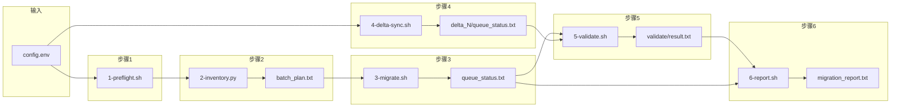
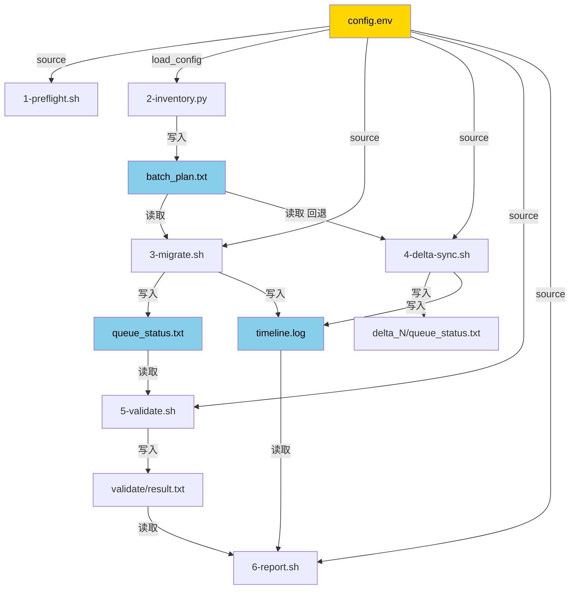

---
tags:
  - AzureStorage
  - Migration
  - AzCopy
  - Toolkit
  - Design
  - Mooncake
category: Azure Storage / Migration Toolkit
area: Cross-Region Migration — Design
related:
  - "[[Storage 跨区域迁移工具包 — AzCopy Migration Toolkit]]"
  - "[[Storage 跨区域迁移工具包 — 使用指南]]"
  - "[[Azure Storage 跨区域迁移 — 方案选型与总览]]"
  - "[[跨区域迁移 1TB 小文件测试方案 — Blob 与 Azure Files]]"
parent: "[[Storage 跨区域迁移工具包 — AzCopy Migration Toolkit]]"
created: 2026-03-09
---

# Storage 跨区域迁移工具包 — 设计文档

> [!abstract] 读者
> 本文面向**工具包开发者和维护者**，描述架构设计、核心模式、关键设计决策及其原因。使用方法请参考 [[Storage 跨区域迁移工具包 — 使用指南]]。

---

## 一、整体架构

### 1.1 技术选型

| 决策 | 选择 | 原因 |
|------|------|------|
| 数据传输引擎 | AzCopy（非 ADF） | 1TB 测试显示吞吐量一致，但 AzCopy 无需配置 IR/Pipeline，客户自助更简单 |
| 编排语言 | Bash + Python | Bash 驱动 azcopy CLI，Python 调用 Azure SDK 做盘点/验证（SDK 无 CLI 等价操作） |
| 配置方式 | 单文件 `config.env` | 所有脚本 `source config.env`，客户只需编辑一个文件 |
| 拷贝模式 | S2S（Service-to-Service） | 数据在 Azure 存储服务器间直传，不经过 VM 带宽 |
| 端点 | `core.chinacloudapi.cn` | Azure China 专用域名（非 Global 的 `core.windows.net`） |

> [!tip] 为什么不用 ADF？
> 基于 [[跨区域迁移 1TB 小文件测试方案 — Blob 与 Azure Files]] 的对比测试：
> - AzCopy S2S 和 ADF Copy Activity 吞吐量基本一致
> - AzCopy 支持 `--preserve-smb-permissions`（ADF 不支持）
> - AzCopy 可脚本化，适合交付给客户自助执行
> - ADF 需要创建 IR + Linked Service + Dataset + Pipeline，操作门槛高

### 1.2 文件结构与职责

```
migration-toolkit/
├── config.env          ← 全局配置（所有脚本 source 此文件）
├── 1-preflight.sh      ← 预检：依赖安装 + SAS 参数校验 + 连通性测试
├── 2-inventory.py      ← 盘点：Python SDK 枚举文件 → 生成 batch_plan.txt + 费用估算
├── 3-migrate.sh        ← 全量迁移：后台调度器 + 分批 azcopy copy
├── 4-delta-sync.sh     ← 增量同步：后台调度器 + 按容器并行 azcopy copy
├── 5-validate.sh       ← 验证：文件数/大小对比 + 随机抽样属性校验
├── 6-report.sh         ← 报告：汇总 timeline + 验证结果 → migration_report.txt
├── batch_plan.txt      ← [自动生成] 2-inventory.py 的输出
└── status.sh           ← [废弃] 已合并到 3-migrate.sh status
```

### 1.3 数据流



---

## 二、核心设计模式

### 2.1 后台调度器模式（Scheduler Pattern）

`3-migrate.sh` 和 `4-delta-sync.sh` 共享同一套调度架构：

```
用户执行 bash 3-migrate.sh
│
├── [前台] 参数校验、初始化 queue_status.txt
│
├── nohup bash -c '...' > scheduler.log 2>&1 &
│   │                    ↑ 调度器进程（后台）
│   │
│   ├── echo $$ > scheduler.pid        ← 记录自身 PID
│   │
│   └── while true 调度循环:
│       ├── 读取 queue_status.txt 中 running 和 queued 的数量
│       ├── if running < MAX_PARALLEL_JOBS && 还有 queued:
│       │   ├── sed -i: queued → running
│       │   ├── nohup bash -c 'azcopy copy ...' > batch_001.log &
│       │   │                  ↑ 工作进程（后台）
│       │   │   └── 完成后 sed -i: running → completed/failed
│       │   └── echo $! > batch_001.pid     ← 记录工作进程 PID
│       │
│       ├── if running == 0 && queued == 0: break
│       └── sleep 30（3-migrate）/ sleep 15（4-delta-sync）
│
└── [前台] 输出 PID 和常用命令提示，立即返回
```

**设计要点：**

| 要素 | 实现 | 为什么 |
|------|------|--------|
| 调度器后台化 | 外层 `nohup bash -c '...' &` | SSH 断连后调度器继续运行 |
| 工作进程后台化 | 内层 `nohup bash -c 'azcopy ...' &` | 每个 batch 独立进程，互不影响 |
| 双层 nohup | 调度器 nohup + 工作进程 nohup | 即使调度器被 kill，已启动的 azcopy 仍在运行 |
| 防重复启动 | 检查 `scheduler.pid` + `kill -0` | 避免多个调度器同时操作 queue |

### 2.2 状态机（Queue Status）

`queue_status.txt` 是核心状态文件，格式为 `batch_id|status`：

```
                    ┌─────────────────────────┐
                    │                         │
              ┌─────▼─────┐            ┌──────┴──────┐
  初始化 ───► │  queued    │            │  stopped    │
              └─────┬─────┘            └──────▲──────┘
                    │ 调度器启动                │ stop 命令
              ┌─────▼─────┐                    │
              │  running   ├───────────────────┘
              └──┬─────┬──┘
                 │     │
          ┌──────▼┐   ┌▼───────┐
          │completed│  │ failed │
          └────────┘   └───┬───┘
                           │ resume 模式
                     ┌─────▼─────┐
                     │  queued    │  (重新入队)
                     └───────────┘
```

**状态转换规则：**

| 转换 | 触发者 | 机制 |
|------|--------|------|
| `queued → running` | 调度器 | `sed -i` 原子写入 |
| `running → completed` | 工作进程（azcopy 退出码 0） | `sed -i` |
| `running → failed` | 工作进程（azcopy 退出码 != 0） | `sed -i` |
| `running → stopped` | `stop` 子命令 | `sed -i` |
| `running/failed/stopped → queued` | resume 模式 | `sed -i`（保留 completed） |

### 2.3 PID 文件追踪（Process Isolation）

```
LOG_DIR/
├── scheduler.pid              ← 调度器 PID（3-migrate.sh）
├── batch_001.pid              ← batch_001 工作进程 PID
├── batch_002.pid              ← batch_002 工作进程 PID
├── delta_scheduler.pid        ← 增量同步调度器 PID（4-delta-sync.sh）
└── delta_1/
    ├── container-a.pid        ← container-a 同步进程 PID
    └── container-b.pid        ← container-b 同步进程 PID
```

> [!important] 为什么用 PID 文件而不是 `pkill azcopy`？
> `pkill azcopy` 会杀掉 VM 上**所有** azcopy 进程，包括其他脚本启动的。比如：
> - `3-migrate.sh` 启动了 3 个 azcopy（全量迁移）
> - `4-delta-sync.sh stop` 执行 `pkill azcopy` → **全量迁移的 azcopy 也被杀了**
>
> PID 文件方案：每个工作进程启动时 `echo $! > batch_001.pid`，stop 时只读取自己脚本的 PID 文件，通过 `kill $pid` 精确停止。

**stop 命令流程：**

```bash
# 1. 停调度器
kill $(cat scheduler.pid)

# 2. 遍历本脚本的 PID 文件，逐个停止
for pid_file in ${LOG_DIR}/batch_*.pid; do    # migrate 用 batch_*.pid
    pid=$(cat "$pid_file")
    pkill -P "$pid"   # 先杀子进程 (azcopy)
    kill "$pid"       # 再杀 nohup bash 包装进程
    rm "$pid_file"
done
```

### 2.4 子命令模式（Subcommand Pattern）

`3-migrate.sh` 和 `4-delta-sync.sh` 都支持三种用法：

```bash
bash 3-migrate.sh            # 默认：启动迁移
bash 3-migrate.sh stop       # 停止迁移
bash 3-migrate.sh status     # 查看进度
```

实现方式：脚本开头用 `if [ "${1:-}" = "stop" ]` 和 `if [ "${1:-}" = "status" ]` 分支，命中后 `exit 0`，不命中则继续执行主流程。

### 2.5 恢复模式（Resume on Crash）

`3-migrate.sh` 支持 VM 重启后恢复：

```bash
if [ -f "$QUEUE_FILE" ]; then
    prev_completed=$(grep -c '|completed' "$QUEUE_FILE") || true
    prev_total=$(wc -l < "$QUEUE_FILE") || true

    if completed > 0 && completed < total:
        # 恢复模式：保留 completed，其余重置为 queued
        sed -i 's/|running$/|queued/'  "$QUEUE_FILE"
        sed -i 's/|stopped$/|queued/'  "$QUEUE_FILE"
        sed -i 's/|failed$/|queued/'   "$QUEUE_FILE"

    elif completed == total:
        # 全部完成，直接退出
        exit 0
fi
```

**三种场景：**

| 场景 | 行为 |
|------|------|
| 无 `queue_status.txt` | 全新初始化 |
| 有文件，部分 completed | 恢复模式：保留已完成的，其余重新入队 |
| 有文件，全部 completed | 提示已完成，不重复执行 |

> [!note] 4-delta-sync.sh 没有恢复模式
> 增量同步是幂等操作（`--overwrite ifSourceNewer`），直接重新执行即可，无需恢复上次进度。

---

## 三、关键设计决策

### 3.1 增量同步：`azcopy copy` 而非 `azcopy sync`

| | `azcopy copy --overwrite ifSourceNewer` | `azcopy sync` |
|---|---|---|
| **扫描方式** | 流式处理，边枚举边拷贝 | 先扫描源端和目标端到内存，再计算差异 |
| **内存占用** | 低（不需要内存索引） | 高（需要双端文件列表） |
| **List API 费用** | 只扫描源端 | 源端 + 目标端都要扫描（List 费用翻倍） |
| **大文件数场景** | 适合（千万级） | 不适合（indexing 阶段极慢） |
| **官方推荐** | Microsoft 文档推荐用于大规模迁移 | 适合小规模双向同步 |

> [!important] 结论
> Microsoft 官方文档明确推荐大文件数场景使用 `azcopy copy --overwrite ifSourceNewer` 而非 `azcopy sync`。sync 的 indexing 阶段在千万文件级别会极其缓慢。

### 3.2 验证：属性比对而非 MD5 下载

| | Python SDK 属性比对（当前方案） | 下载文件做 MD5 |
|---|---|---|
| **原理** | `get_blob_properties()` 比对 size | 下载整个文件计算 MD5 |
| **网络开销** | 每文件 1 个 API 调用（几 KB） | 每文件下载完整内容 |
| **速度** | 100 文件 < 10 秒 | 100 文件可能数小时 |
| **费用** | 极低（GET Properties） | 极高（出站带宽费） |
| **可靠性** | S2S 通过 HTTPS 传输，Azure 保证完整性 | 实际上是冗余校验 |

> [!tip] 为什么不需要 MD5？
> AzCopy S2S 是 Azure 存储服务器之间直传，走 HTTPS 加密通道。数据不经过 VM 或公网，Azure 平台保证传输完整性。文件大小一致已足以确认拷贝正确。

### 3.3 `grep -c` 的 exit code 陷阱

**问题：** `grep -c '|queued' file || echo 0` 在匹配数为 0 时产生 `"0\n0"` 而非 `"0"`。

原因：`grep -c` 匹配到 0 行时返回 exit code 1（虽然它输出了 `0`），触发 `|| echo 0`，变量变成多行字符串 `"0\n0"`，后续 `[ "$var" -eq 0 ]` 报 `integer expression expected`。

**正确写法：**

```bash
# 错误写法（所有脚本的原始 bug）
count=$(grep -c '|queued' "$FILE" || echo 0)

# 正确写法
count=$(grep -c '|queued' "$FILE" 2>/dev/null) || true
count=${count:-0}
```

### 3.4 并发度控制

| 参数 | 默认值 | 作用域 | 说明 |
|------|--------|--------|------|
| `MAX_PARALLEL_JOBS` | 3 | 调度器级别 | 同时运行的 azcopy 进程数 |
| `AZCOPY_CONCURRENCY` | 128 | 单个 azcopy 进程内部 | HTTP 并发连接数 |
| `MAX_FILES_PER_BATCH` | 800 万 | 分批策略 | 单 batch 文件数上限 |
| `MAX_GB_PER_BATCH` | 10000 (10TB) | 分批策略 | 单 batch 数据量上限 |

> [!warning] `AZCOPY_CONCURRENCY` 不能太高
> 跨区域 S2S 场景下，设置 1000 会导致 Go 协程（goroutine）堆积，触发 panic 崩溃。建议值：64-256，跨区域不超过 256。azcopy 默认值 300 是为同区域优化的。

### 3.5 分批策略

`2-inventory.py` 的分批逻辑同时考虑**文件数**和**数据量**，任一超限即按顶层目录拆分：

```python
MAX_FILES = config['MAX_FILES_PER_BATCH']  # 默认 800 万
MAX_BYTES = config['MAX_GB_PER_BATCH'] * 1024**3  # 默认 10 TB

if total_count <= MAX_FILES and total_bytes <= MAX_BYTES:
    # 两个条件都满足 → 整个容器作为 1 个 batch
else:
    # 任一超限 → 按顶层目录拆分为多个 batch
    for dir_name in container.top_level_dirs:
        batches.append(batch(container, path=dir_name))
```

**为什么需要两个维度？**

| 维度 | 限制 | 原因 |
|------|------|------|
| 文件数 ≤ 800 万 | AzCopy 官方建议单 Job < 1000 万文件，超过 5000 万性能明显下降 |  800 万留 20% 余量 |
| 数据量 ≤ 10 TB | 单进程传输超大数据量存在单点故障风险，崩溃后重试代价高 | 拆分后可并行传输且缩小失败重试范围 |

> [!tip] 场景示例
> 一个容器有 50 万文件但 30TB 数据（大量视频/备份文件）：
> - 旧逻辑：50 万 < 800 万 → 不分批 → 1 个 azcopy 跑 30TB
> - 新逻辑：50 万 < 800 万 **但** 30TB > 10TB → 按顶层目录拆分 → 多个 azcopy 并行

### 3.6 Azure Files 特殊处理（SMB / NFS）

`STORAGE_TYPE` 支持三种值，脚本根据类型自动选择不同的参数和 SDK：

#### 三种 STORAGE_TYPE 对照

| 环节 | `blob` | `files-smb` | `files-nfs` |
|------|--------|-------------|-------------|
| 端点域名 | `.blob.` | `.file.` | `.file.` |
| 创建目标容器/共享 | `azcopy make` | `azcopy make` | `azcopy make` |
| azcopy copy 额外参数 | 无 | `--preserve-smb-permissions=true --preserve-smb-info=true` | `--preserve-permissions=true --preserve-info=true --from-to=FileNFSFileNFS` |
| 保留的权限 | — | NTFS ACL | POSIX uid/gid/mode |
| 保留的属性 | — | SMB 属性（只读、隐藏、创建/修改时间） | 创建时间、最后写入时间 |
| 盘点枚举 SDK | `BlobServiceClient.list_blobs()` | `ShareServiceClient` 递归 `walk_directory()` | `ShareServiceClient` 递归 `walk_directory()` |
| 抽样校验 SDK | `BlobServiceClient` + `get_blob_properties()` | `ShareServiceClient` + `get_file_properties()` | `ShareServiceClient` + `get_file_properties()` |
| SAS Services 校验 | `ss` 含 `b` | `ss` 含 `f` | `ss` 含 `f` |

> [!important] SMB vs NFS 权限保留参数不同
> - **SMB**：`--preserve-smb-permissions` 保留 NTFS ACL，`--preserve-smb-info` 保留 SMB 属性（只读、隐藏等）。ADF 不支持此功能，这是选择 AzCopy 的关键原因之一。
> - **NFS**：`--preserve-permissions` 保留 POSIX owner/group/mode，`--preserve-info` 保留时间戳。必须加 `--from-to=FileNFSFileNFS` 显式指定 NFS-to-NFS 传输模式，否则 AzCopy 按 SMB 处理会失败。
>
> 来源：[MS Learn — Copy files from one Azure file share to another](https://learn.microsoft.com/azure/storage/files/migrate-files-between-shares)

> [!note] NFS 共享的前置要求
> NFS 共享只能在 **Premium FileStorage** 类型的存储账户上创建。目标端也必须是同类型的 Premium FileStorage SA。

### 3.7 容器发现策略（Delta Sync）

`4-delta-sync.sh` 的容器列表获取有三级回退：

```
1. CONTAINER_NAME 已指定 → 只同步该容器
2. Python SDK 实时查询源端 → 能发现全量迁移后新建的容器
3. 回退到 batch_plan.txt → Python 查询失败时的兜底
```

> [!tip] 为什么不直接用 batch_plan.txt？
> 增量同步可能在全量迁移完成数天后执行，期间客户可能新建了容器。实时查询能捕获这些新容器，比静态的 batch_plan.txt 更准确。

---

## 四、config.env 加载机制

`config.env` 被两种方式加载：

| 加载方式 | 使用者 | 机制 |
|----------|--------|------|
| `source config.env` | 所有 `.sh` 脚本 | Bash 直接求值，变量直接可用 |
| `load_config()` 自定义解析 | `2-inventory.py` | Python 逐行解析 key=value，处理引号和行内注释 |

Python 解析器需要处理的边界情况：

```python
# 双引号包裹的值
SRC_SAS="se=2026-06-30&sp=rl"

# 行内注释
MAX_PARALLEL_JOBS=3   # 建议 1-5

# 无引号值
STORAGE_TYPE=blob
```

> [!warning] nohup 内的变量传递
> 后台调度器通过 `nohup bash -c '...'` 启动，这是一个新的 bash 进程，无法继承当前 shell 的变量。所以调度器内部用 `'"${VAR}"'` 语法把变量值内联到脚本字符串中。这种写法虽然丑陋但是必要的——不能用 `source config.env`（路径可能变化），也不能用 `export`（nohup 隔离了环境）。

---

## 五、费用估算模型

`2-inventory.py` 中的 `estimate_cost()` 基于 Azure China 定价：

```
总费用 = 跨区域传输费 + 源端读取操作费 + 目标端写入操作费
       + 源端 List 操作费 + 增量同步费用

跨区域传输费 = total_GB × ¥0.67/GB
源端读取操作费 = (file_count / 10000) × ¥0.036
目标端写入操作费 = (file_count / 10000) × ¥0.36
源端 List 操作费 = (file_count / 5000 / 10000) × ¥0.36

增量同步费用 = 3次 × DELTA_SYNC_RATIO × (传输费 + 操作费)
```

### 5.1 增量同步费用与 `DELTA_SYNC_RATIO`

增量同步的费用取决于源端在迁移期间的数据变化量。由于盘点时无法预知未来的写入量，脚本通过 `DELTA_SYNC_RATIO` 参数让客户自定义估算比例：

| 属性 | 说明 |
|------|------|
| **参数** | `config.env` → `DELTA_SYNC_RATIO` |
| **默认值** | `0.01`（1%） |
| **含义** | 每次增量同步预估传输的数据量占总数据量的比例 |
| **估算逻辑** | 假设执行 3 次增量同步，每次传输 `DELTA_SYNC_RATIO` 比例的数据 |
| **作用范围** | **仅影响费用估算输出**，不影响实际迁移行为 |

**估算公式（代码实现）：**

```python
delta_total_ratio = 3 * DELTA_SYNC_RATIO  # 3 次 × 每次比例
delta_bandwidth = total_gb * delta_total_ratio * BANDWIDTH_PER_GB
delta_ops = (total_count * delta_total_ratio / 10000) * (READ_PER_10K + WRITE_PER_10K)
```

**调整建议：**

| 源端写入情况 | 建议值 | 说明 |
|-------------|--------|------|
| 只读 / 极少写入 | `0.005`（0.5%） | 增量同步基本无数据传输 |
| 正常业务写入 | `0.01`（1%）默认 | 每次 delta 约传输总量的 1% |
| 频繁写入 / ETL 管道 | `0.03`（3%） | 大量新增或更新文件 |
| 高频写入 / 日志收集 | `0.05`（5%） | 每天有显著数据变化 |

> [!note] 为什么假设 3 次？
> 典型的三阶段迁移流程中，增量同步通常执行 2-4 次：全量完成后追一次、切换前再追一次、中间可能还有一次。3 次是合理的中间值。实际执行次数取决于客户的切换时间窗口。

---

## 六、脚本间依赖关系



**硬依赖（必须按顺序）：**
- `1-preflight.sh` → `2-inventory.py`（需要 Python SDK）
- `2-inventory.py` → `3-migrate.sh`（需要 `batch_plan.txt`）
- `3-migrate.sh` → `5-validate.sh`（需要 `queue_status.txt`）

**软依赖（可跳过）：**
- `4-delta-sync.sh` 不依赖 `3-migrate.sh`（可独立发现容器）
- `6-report.sh` 缺少某些输入文件时会显示 N/A

---

## 七、已知限制与改进方向

| 限制 | 原因 | 可能的改进 |
|------|------|-----------|
| 分批粒度为顶层目录 | 简化实现 | 可按文件数进一步拆分子目录 |
| nohup 变量传递丑陋 | Bash 闭包限制 | 可改用 Python 调度器 |
| resume 仅 3-migrate 支持 | 增量同步天然幂等 | — |
| 不支持 Table/Queue Storage | AzCopy 不支持 | 需自定义代码方案 |
| 费用估算为静态定价 | 无 API 查询实时价格 | 可集成 Azure Pricing API |
| 抽样校验仅取前 10000 个文件中随机 100 个 | 大数据集全量校验不现实 | 可分段随机提高覆盖率 |
| 不支持跨云（Global ↔ China） | SAS Token 域名不同 | 需要 AzCopy login 或中转方案 |

---

## 八、参考文档

| 文档 | 链接 |
|------|------|
| AzCopy 性能优化（单 Job 文件数建议） | [learn](https://learn.microsoft.com/en-us/azure/storage/common/storage-use-azcopy-optimize) |
| AzCopy copy vs sync 对比 | [learn](https://learn.microsoft.com/en-us/azure/storage/common/storage-use-azcopy-blobs-copy) |
| Azure China Bandwidth 定价 | [azure.cn](https://www.azure.cn/pricing/details/bandwidth/) |
| Azure China Blob 操作定价 | [azure.cn](https://www.azure.cn/pricing/details/storage/blobs/) |
| 1TB 测试方案 | [[跨区域迁移 1TB 小文件测试方案 — Blob 与 Azure Files]] |
| 方案选型总览 | [[Azure Storage 跨区域迁移 — 方案选型与总览]] |
